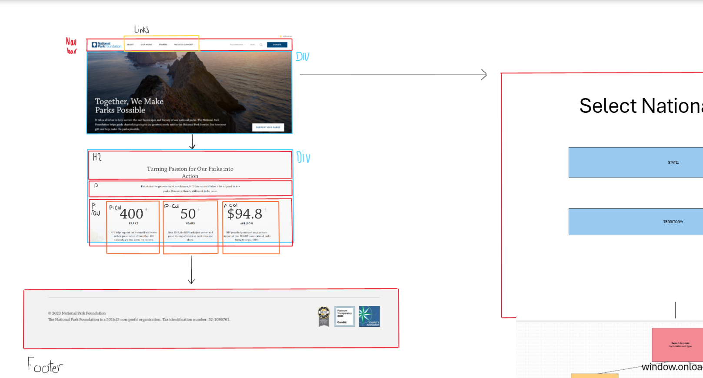
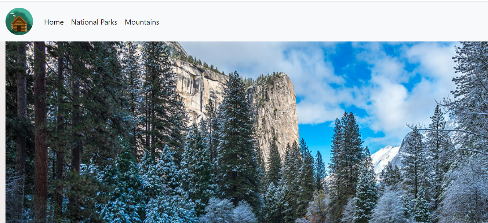
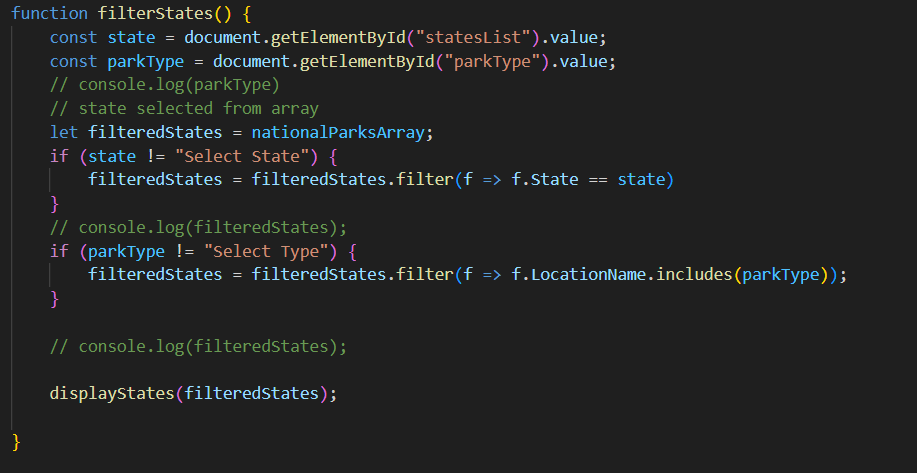
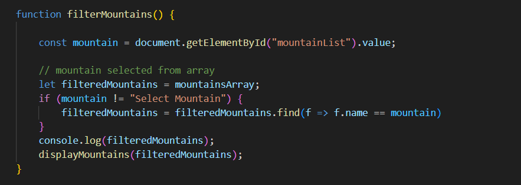

# EnjoyTheOutdoors

Enjoy the outdoors is a website that allows the user to search for national parks and mountains. The user is able to look up national parks by, location or by type; from the national parks within the Enjoy the outdoors website. The user is also allowed to look up mountains from a category selector that displays information regarding the mountain selected.  

## Description

This website was created using HTML, CSS, Bootstrap, and JavaScript.

### pre-whiteboarding
Before I started building my website, I started to plan how I was going to display my website information and images. I took a look at some websites and took their ideas on how I wanted my website to flow. I added an image that helps to portray  what I mean down below.

### Home Page

For my homepage I went with a subtle and simple approac, I also incorportated the same approach to the National Parks and Mountains page.

### National Parks

For my national parks page I filtered through an array to find national parks using the filter function as shown below.

### Mountains

For my mountains page I filtered through an array to find mountains using the find function as shown below.

## Author

 [Martin Enriquez](https://github.com/TherealJGatsby) 

## Acknowledgments 

 [Bootstrap](https://getbootstrap.com/docs/4.1/components/forms/#inline-forms)
 [font-awesome](https://cdnjs.com/libraries/font-awesome)

