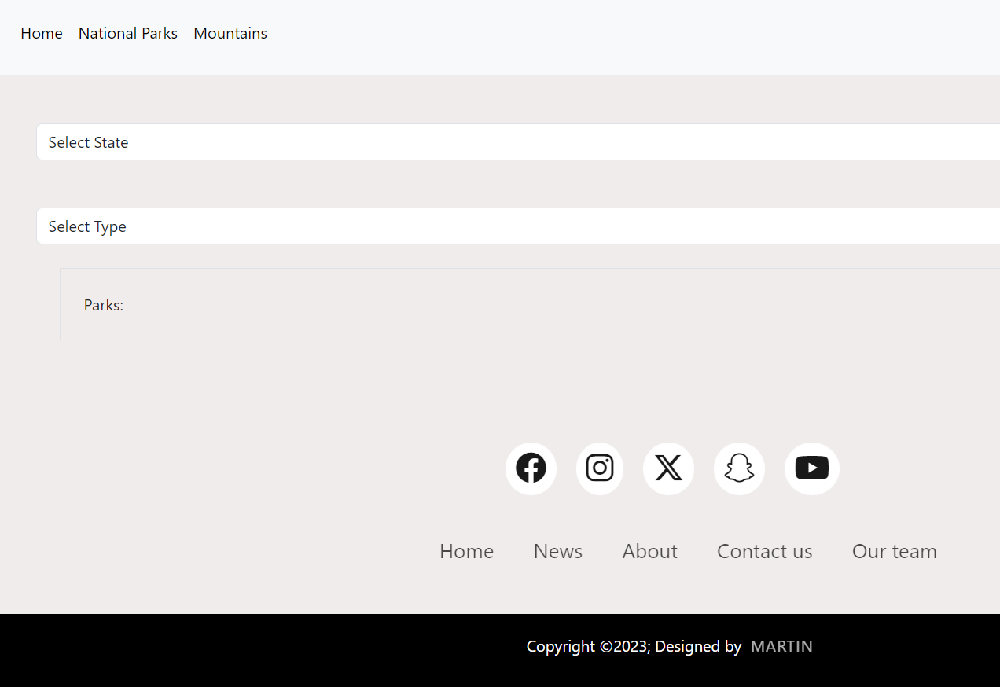

# EnjoyTheOutdoors

Enjoy the outdoors is a website that allows the user to search for national parks and mountains. The user is able to look up national parks by, location or by type; from the national parks within the Enjoy the outdoors website. The user is also allowed to look up mountains from a category selector that displays information regarding the mountain selected.  

## Description

This website was created using HTML, CSS, Bootstrap, and JavaScript.

## Author

 [Martin Enriquez](https://github.com/TherealJGatsby) 

## Acknowledgments 

 [Bootstrap](https://getbootstrap.com/docs/4.1/components/forms/#inline-forms)
 [font-awesome](https://cdnjs.com/libraries/font-awesome)

